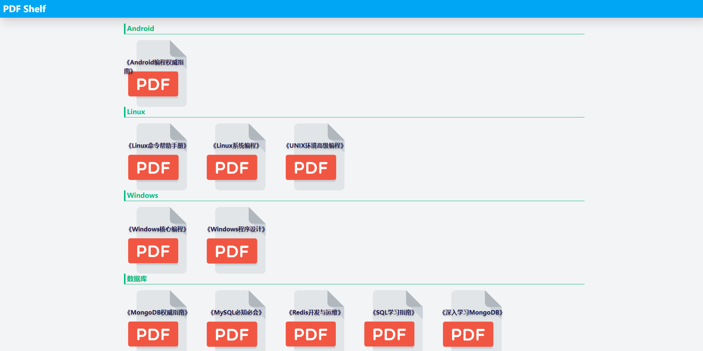
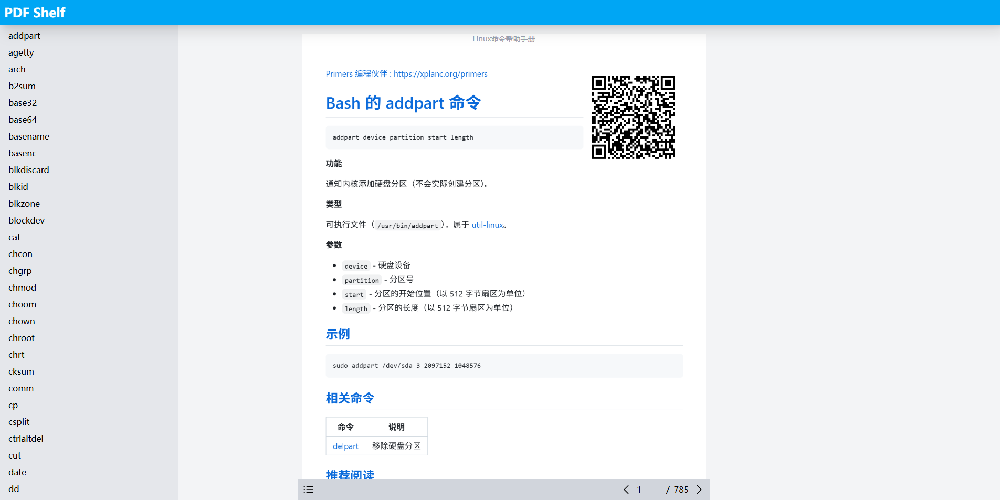

## PDF Shelf 

项目说明

PDF sharing site - PDF 分享站点

## Usage

在 `public/pdfs` 目录中创建下级目录作为分类，在分类目录中存放 PDF 文档。

运行 `npm run scan` 进行扫描，生成 PDF 索引文件。

运行 `npm run build` 进行构建。

## 辅助工具

* [PDF 拆分工具](https://misc.xplanc.org/pdf-split)
* [PDF 合并工具](https://misc.xplanc.org/pdf-merge)

## 引用项目

* https://www.open-std.org/
* https://github.com/sarabander/sicp-pdf
* https://github.com/rust-lang/book
* https://github.com/Jing--Li/book
* https://github.com/ailyanlu1/free-programming-books.pdf
* https://github.com/0voice/expert_readed_books
* https://github.com/TapXWorld/ChinaTextbook
* https://github.com/zxysilent/books
* https://github.com/Kensuke-Hinata/statistic

## 文档目录

> 共收录 116 部书籍

- Android
  - [Android编程权威指南](https://pdf-shelf.pages.dev/1a8e00a0ab)
- C++
  - [C++ Primer 5th edition](https://pdf-shelf.pages.dev/6916b41734)
  - [C++ Primer Plus 第五版 中文](https://pdf-shelf.pages.dev/6ff82ee07f)
  - [C++ Primer 第四版 中文](https://pdf-shelf.pages.dev/ed3694edf2)
  - [Effective C++ 3rd ed](https://pdf-shelf.pages.dev/a4db8dc469)
  - [Effective C++ 第三版 中文](https://pdf-shelf.pages.dev/c1ac781ccf)
  - [More Effective C++中文版](https://pdf-shelf.pages.dev/2cf701e952)
- C语言
  - [C Primer Plus 第六版 中文](https://pdf-shelf.pages.dev/cea93cd38f)
  - [C专家编程](https://pdf-shelf.pages.dev/4769365521)
  - [C语言接口与实现](https://pdf-shelf.pages.dev/d25c9c149c)
  - [C陷阱与缺陷](https://pdf-shelf.pages.dev/0efc8d68b0)
- Go
  - [Go程序设计语言](https://pdf-shelf.pages.dev/c5c9fae1ae)
  - [Go语言圣经](https://pdf-shelf.pages.dev/7dbfc1753f)
  - [Go语言实战](https://pdf-shelf.pages.dev/5fbc1d1e4f)
  - [Go高级编程](https://pdf-shelf.pages.dev/d12c1616d2)
- Java
  - [Effective Java 中文版（第2版）](https://pdf-shelf.pages.dev/0614b84a44)
  - [Java编程思想](https://pdf-shelf.pages.dev/775b57aa9e)
- Kotlin
  - [Kotlin编程权威指南](https://pdf-shelf.pages.dev/a6d79559c7)
- Linux
  - [Linux内核完全剖析（基于0.11内核）](https://pdf-shelf.pages.dev/d3a8e1b186)
  - [Linux内核设计与实现（第三版）](https://pdf-shelf.pages.dev/8926d7bfc5)
  - [Linux命令帮助手册](https://pdf-shelf.pages.dev/448bfafbf5)
  - [Linux系统编程](https://pdf-shelf.pages.dev/9bdee2d999)
  - [UNIX环境高级编程](https://pdf-shelf.pages.dev/7680344cf8)
  - [UNIX网络编程卷1：套接字API](https://pdf-shelf.pages.dev/d429605503)
  - [UNIX网络编程卷2：进程间通信](https://pdf-shelf.pages.dev/c4298ff102)
  - [深入Linux内核架构](https://pdf-shelf.pages.dev/2291b24b24)
  - [深入理解linux内核（第三版）](https://pdf-shelf.pages.dev/19f4af177c)
  - [跟我一起写makefile](https://pdf-shelf.pages.dev/aff2845f77)
  - [鸟哥的 Linux 私房菜：基础学习篇 第四版](https://pdf-shelf.pages.dev/3385727149)
  - [鸟哥的Linux私房菜：服务器架设篇 第三版](https://pdf-shelf.pages.dev/43a709eb79)
- MongoDB
  - [MongoDB权威指南](https://pdf-shelf.pages.dev/c4d8d93c84)
  - [深入学习MongoDB](https://pdf-shelf.pages.dev/ffc0eace1e)
- Python
  - [Python Cookbook](https://pdf-shelf.pages.dev/7ac76e649f)
  - [Python内置函数帮助手册](https://pdf-shelf.pages.dev/405c3b9886)
  - [Python基础教程](https://pdf-shelf.pages.dev/30200a7962)
  - [Python数据分析基础](https://pdf-shelf.pages.dev/99e899324c)
  - [Python数据分析基础教程：NumPy学习指南（第2版）](https://pdf-shelf.pages.dev/545c5b9183)
  - [Python核心编程](https://pdf-shelf.pages.dev/cf9ee59a15)
  - [Python科学计算基础教程](https://pdf-shelf.pages.dev/790aca9211)
  - [Python科学计算最佳实践：SciPy指南](https://pdf-shelf.pages.dev/40f5bc9545)
  - [Python编程：从入门到实践](https://pdf-shelf.pages.dev/09e317d46d)
  - [Python网络爬虫权威指南（第2版）](https://pdf-shelf.pages.dev/ca818a676b)
  - [Python网络编程攻略](https://pdf-shelf.pages.dev/0d790d3bd8)
  - [PyTorch官方教程中文版](https://pdf-shelf.pages.dev/db391be00e)
  - [利用Python进行数据分析](https://pdf-shelf.pages.dev/9386b895c1)
  - [用Python写网络爬虫](https://pdf-shelf.pages.dev/b52d17a986)
  - [精通Python爬虫框架Scrapy](https://pdf-shelf.pages.dev/b470749716)
- Redis
  - [Redis入门指南（第2版）](https://pdf-shelf.pages.dev/af94d77093)
  - [Redis开发与运维](https://pdf-shelf.pages.dev/a5780e7a51)
- Rust
  - [Rust程序设计语言](https://pdf-shelf.pages.dev/0ade59984b)
- SQL
  - [MySQL必知必会](https://pdf-shelf.pages.dev/54b1e7ab59)
  - [PostgreSQL即学即用（第3版）](https://pdf-shelf.pages.dev/d88a9bf6ff)
  - [SQL基础教程（第2版）](https://pdf-shelf.pages.dev/654b9d3799)
  - [SQL学习指南](https://pdf-shelf.pages.dev/07d8a8cc55)
  - [SQL必知必会（第4版）](https://pdf-shelf.pages.dev/3356a05033)
- Web
  - [Bootstrap实战（第2版）](https://pdf-shelf.pages.dev/d1b6b1db0a)
  - [Bootstrap用户手册：设计响应式网站](https://pdf-shelf.pages.dev/cde81684b6)
  - [HTML5与CSS3基础教程（第8版）](https://pdf-shelf.pages.dev/50a8b221db)
  - [HTML5与CSS3实例教程（第2版）](https://pdf-shelf.pages.dev/da33209584)
  - [HTML与CSS入门经典（第9版）](https://pdf-shelf.pages.dev/179575b948)
  - [JavaScript权威指南(第6版)](https://pdf-shelf.pages.dev/f9007f6a1e)
  - [JavaScript语言精粹](https://pdf-shelf.pages.dev/ef84d5d3db)
  - [JavaScript高级程序设计](https://pdf-shelf.pages.dev/2a17e60251)
  - [Node.js实战](https://pdf-shelf.pages.dev/29a3e861ca)
  - [Node.js开发指南](https://pdf-shelf.pages.dev/9a50f58581)
  - [Node与Express开发](https://pdf-shelf.pages.dev/9d30fbd36e)
  - [PWA开发实战](https://pdf-shelf.pages.dev/539f196b82)
  - [React实战](https://pdf-shelf.pages.dev/4c38a34025)
  - [React快速上手开发](https://pdf-shelf.pages.dev/a95ff81df6)
  - [Vue.js 前端开发 快速入门与专业应用](https://pdf-shelf.pages.dev/2c37a5d83a)
  - [Vue.js项目实战](https://pdf-shelf.pages.dev/7044019e0a)
  - [WebAssembly实战](https://pdf-shelf.pages.dev/95c0f14685)
  - [WebAssembly标准入门](https://pdf-shelf.pages.dev/98d9a0db92)
  - [深入浅出React和Redux](https://pdf-shelf.pages.dev/3e7a2d343f)
- Windows
  - [Windows核心编程](https://pdf-shelf.pages.dev/f008269e3e)
  - [Windows程序设计](https://pdf-shelf.pages.dev/06b3b7f3c1)
- 小学数学
  - [数学一年级上册](https://pdf-shelf.pages.dev/28b1462563)
  - [数学一年级下册](https://pdf-shelf.pages.dev/a37f210770)
  - [数学三年级上册](https://pdf-shelf.pages.dev/11331ba015)
  - [数学三年级下册](https://pdf-shelf.pages.dev/29fd000a4e)
  - [数学二年级上册](https://pdf-shelf.pages.dev/ae2646b51a)
  - [数学二年级下册](https://pdf-shelf.pages.dev/5ce4f250f5)
  - [数学五年级上册](https://pdf-shelf.pages.dev/24487ff378)
  - [数学五年级下册](https://pdf-shelf.pages.dev/0944c6bc69)
  - [数学六年级上册](https://pdf-shelf.pages.dev/2bb1121d78)
  - [数学六年级下册](https://pdf-shelf.pages.dev/6e9d23343b)
  - [数学四年级上册](https://pdf-shelf.pages.dev/1ed27feb5b)
  - [数学四年级下册](https://pdf-shelf.pages.dev/4cd1c9f7ef)
- 汇编语言
  - [汇编语言 第4版](https://pdf-shelf.pages.dev/3ed146240f)
- 网络
  - [HTTP_2基础教程](https://pdf-shelf.pages.dev/45ddeb4f56)
  - [HTTP权威指南](https://pdf-shelf.pages.dev/5c965e7fef)
  - [TCP_IP详解卷1：协议](https://pdf-shelf.pages.dev/d80209a7b8)
  - [TCP_IP详解卷2：实现](https://pdf-shelf.pages.dev/324384b9ea)
  - [TCP_IP详解卷3：TCP事务协议，HTTP，NNTP和UNIX域协议](https://pdf-shelf.pages.dev/27ad9b7c50)
  - [Web性能权威指南](https://pdf-shelf.pages.dev/00a4c2fef1)
  - [Wireshark数据包分析实战（第3版）](https://pdf-shelf.pages.dev/547432c86c)
  - [图解HTTP](https://pdf-shelf.pages.dev/4aad2eeea3)
- 计算机基础
  - [SICP](https://pdf-shelf.pages.dev/caeb7ad737)
  - [数据结构与算法分析](https://pdf-shelf.pages.dev/9b164d431a)
  - [深入理解计算机系统](https://pdf-shelf.pages.dev/f1c5b9ef64)
  - [现代操作系统第三版](https://pdf-shelf.pages.dev/c27265f439)
  - [算法导论](https://pdf-shelf.pages.dev/02d62e61b1)
  - [算法（第4版）](https://pdf-shelf.pages.dev/b6ffc9456d)
  - [计算机程序的构造和解释](https://pdf-shelf.pages.dev/a31df151c9)
- 说明书
  - [C++11](https://pdf-shelf.pages.dev/6e82de0484)
  - [C++14](https://pdf-shelf.pages.dev/7a603c2d19)
  - [C++17](https://pdf-shelf.pages.dev/adb1984563)
  - [C++20](https://pdf-shelf.pages.dev/fbc4e30c70)
  - [C++23](https://pdf-shelf.pages.dev/021360018a)
  - [C11](https://pdf-shelf.pages.dev/47496b4a2a)
  - [C17](https://pdf-shelf.pages.dev/068381d919)
  - [C23](https://pdf-shelf.pages.dev/75610938eb)
  - [C99](https://pdf-shelf.pages.dev/6eedafa68b)
  - [Miracast_Specification_v2.2](https://pdf-shelf.pages.dev/71a97add09)
- 通识基础
  - [人月神话](https://pdf-shelf.pages.dev/1c6e4108a4)
  - [如何阅读一本书](https://pdf-shelf.pages.dev/c24e5ccc33)
